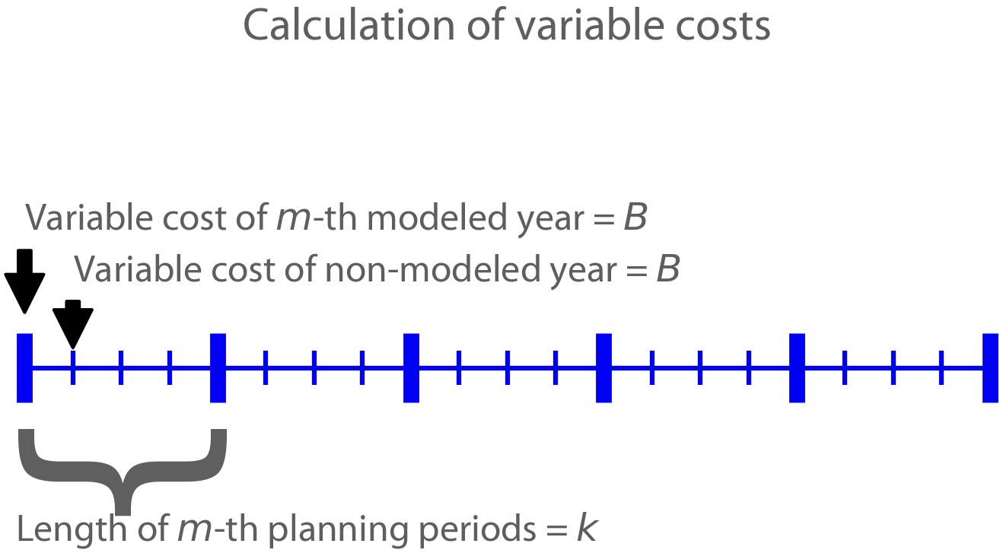
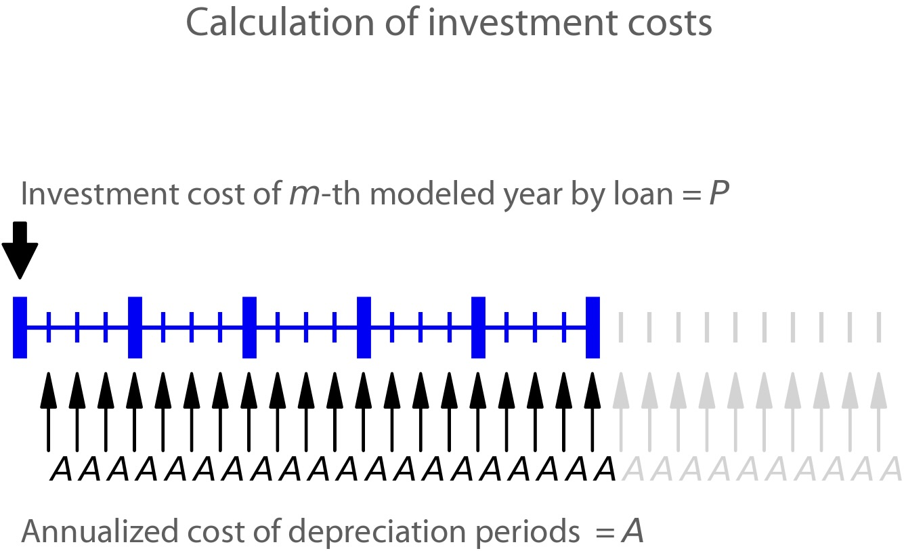

Mathematical Notation
=========================

This page provides a detailed description of the mathematical notations used for formulating the model's objective function and constraints :cite:p:`liu2023`.

Unit List
---------

The description of the units used in this page are as follows:

.. list-table::
   :widths: 10 50
   :header-rows: 1
   :align: left

   * - Unit
     - Description

   * - hr
     - Hour

   * - yr
     - Year

   * - dollar
     - US Dollar

   * - kW
     - Kilowatt

   * - MW
     - Megawatt

   * - MWh
     - Megawatt-hour

   * - MWy
     - Megawatt-year

   * - MW-km
     - Megawatt-kilometer

   * - tonne
     - Tonne
   
   * - m
     - Meter

   * - s
     - Second

   * - N/A
     - Not Applicable

Set List
--------

.. list-table::
   :widths: 30 60 10
   :header-rows: 1
   :align: left

   * - Set
     - Description
     - Unit

   * - :math:`e \in \mathcal{E}`
     - Technology
     - N/A

   * - :math:`h, h_{\rm{start}}, h_{\rm{end}} \in \mathcal{H}`
     - Hour
     - hr

   * - :math:`y, y_{\rm{next}}, y_{\rm{pre}}, y_{\rm{start}}, y_{\rm{end}} \in \rm \mathcal{Y}`
     - Year
     - yr

   * - :math:`m \in \rm \mathcal{M}`
     - Month
     - N/A

   * - :math:`z, z_{\rm{from}}, z_{\rm{to}} \in \mathcal{Z}`
     - Zone
     - N/A

   * - :math:`{\rm{age}} \in \mathcal{AGE}`
     - Operation time
     - yr

   * - :math:`s, {\rm{su}} \in \mathcal{S}`
     - Hydropower station
     - N/A

   * - :math:`\mathcal{IU}_{\it{s}} \in \mathcal{S}`
     - Immediate upstream hydropower stations of hydropower station :math:`s`
     - N/A

   * - :math:`\mathcal{SZ}_{\it{z}} \in \mathcal{S}`
     - Subset of hydropower stations located in zone :math:`z`
     - N/A

   * - :math:`\mathcal{DISP} \in \mathcal{E}`
     - Subset of dispatchable technology
     - N/A

   * - :math:`\mathcal{NDISP} \in \mathcal{E}`
     - Subset of non-dispatchable technology
     - N/A

   * - :math:`\mathcal{STOR} \in \mathcal{E}`
     - Subset of storage technology
     - N/A

Variable List
-------------

.. list-table::
   :widths: 20 70 10
   :header-rows: 1
   :align: left
  
   * - Symbol
     - Description
     - Unit

   * - :math:`\rm{cost}^{\rm{total}}`
     - System-wide total cost.
     - dollar

   * - :math:`\rm{cost}^{\rm{var}}_{\rm{tech}}`
     - System-wide variable Operation and Maintenance (O&M) cost of technologies.
     - dollar

   * - :math:`\rm{cost}^{\rm{fuel}}`
     - System-wide fuel cost of technologies.
     - dollar

   * - :math:`\rm{cost}^{\rm{fix}}_{\rm{tech}}`
     - System-wide fixed O&M cost of technologies.
     - dollar

   * - :math:`\rm{cost}^{\rm{fix}}_{\rm{line}}` 
     - System-wide fixed O&M cost of transmission lines.
     - dollar

   * - :math:`\rm{cost}^{\rm{inv}}_{\rm{tech}}`
     - System-wide capital cost of technologies.
     - dollar

   * - :math:`\rm{cost}^{\rm{inv}}_{\rm{line}}`
     - System-wide capital cost of transmission lines.
     - dollar

   * - :math:`\rm{cost}^{\rm{annualfuel}}_{\it{y}}`
     - Fuel cost of technologies in the modelled year:math:`y` (the present value of modelled year :math:`y`).
     - dollar

   * - :math:`\rm{cost}^{\rm{fuel}}_{\it{y}}`
     - Fuel cost of technologies accumulated from modelled year :math:`y` to a non-modelled year before the immediate next modelled year (the present value of modelled year :math:`y`).
     - dollar

   * - :math:`\rm{gen}_{\it{h,m,y,z,e}}`
     - Power generation of technology :math:`e` in zone :math:`z` in hour :math:`h` in month :math:`m` of year :math:`y`.
     - MWh

   * - :math:`\rm{charge}_{\it{h,m,y,z,e}}`
     - Charging electricity of storage technology :math:`e` in zone :math:`z` in hour :math:`h` in month :math:`m` of year :math:`y`.
     - MWh

   * - :math:`\rm{export}_{{\it{h,m,y,z}}_{\rm{from}},{\it{z}}_{\rm{to}}}`
     - Electric energy exported from zone :math:`z_{\rm{from}}` to zone :math:`z_{\rm{to}}` in hour :math:`h` in month :math:`m` of year :math:`y`.
     - MWh

   * - :math:`\rm{import}_{{\it{h,m,y,z}}_{\rm{from}},{\it{z}}_{\rm{to}}}`
     - Electric energy imported from zone :math:`z_{\rm{from}}` to zone :math:`z_{\rm{to}}`  in hour :math:`h` in month :math:`m` of year :math:`y`.
     - MWh

   * - :math:`\rm{storage}_{\it{h,m,y,z,e}}^{\rm{energy}}`
     - Energy storage level of storage technology :math:`e` in hour :math:`h` in month :math:`m` of year :math:`y` in zone :math:`z`.
     - MWh

   * - :math:`\rm{storage}_{\it{s,h,m,y}}^{\rm{reservoir}}` 
     - Reservoir storage corresponding to hydropower station :math:`s` in hour :math:`h` in month :math:`m` of year :math:`y`.
     - :math:`\text{m}^\text{3}`

   * - :math:`\rm{power}_{\it{h,m,y,z,e}}` 
     - Overall power output of technology :math:`e` in zone :math:`z` in hour :math:`h` in month :math:`m` of year :math:`y`.
     - MW

   * - :math:`\rm{power}_{\it{h,m,y,z,e}}^{\it{c}}` 
     - Charging power of storage technology :math:`e` in zone :math:`z` in hour :math:`h` in month :math:`m` of year :math:`y`.
     - MW

   * - :math:`\rm{power}_{\it{h,m,y,z,e}}^{\rm{up}}`
     - Increment in power output of technology :math:`e` in zone :math:`z` from hour :math:`h`-1 to hour :math:`h` in month :math:`m` of year :math:`y`.
     - MW

   * - :math:`\rm{power}_{\it{h,m,y,z,e}}^{\rm{down}}`
     - Decrement in power output of technology :math:`e` in zone :math:`z` from hour :math:`h`-1 to hour :math:`h` in month :math:`m` of year :math:`y`.
     - MW

   * - :math:`\rm{power}_{\it{s,h,m,y}}^{\rm{hydro}}`
     - Power output of hydropower station :math:`s` in hour :math:`h` in month :math:`m` of year :math:`y`.
     - MW

   * - :math:`\rm{cap}_{\it{y,z,e}}^{\rm{existingtech}}`
     - Existing installed capacity of technology :math:`e` in year :math:`y` in zone :math:`z`.
     - MW

   * - :math:`\rm{cap}_{{\it{y,z}}_{\rm{from}},{\it{z}}_{\rm{to}}}^{\rm{existingline}}` 
     - Existing transmission capacity in year :math:`y` from zone :math:`z_{\rm{from}}` to zone :math:`z_{\rm{to}}`.
     - MW

   * - :math:`\rm{cap}_{\it{y,z,e}}^{invtech}`
     - Installed capacity of newly built technology :math:`e` in year :math:`y` in zone :math:`z`.
     - MW
   * - :math:`\rm{cap}_{{\it{y,z}}_{\rm{from}},{\it{z}}_{\rm{to}}}^{\rm{invline}}` 
     - Capacity of newly built transmission lines from zone :math:`z_{\rm{from}}` to zone :math:`z_{\rm{to}}` in year :math:`y`
     - MW
  
   * - :math:`\rm{cap}_{\it{y,z,e}}^{\rm{remaining}}`
     - Remaining installed capacity of technology :math:`e` in year :math:`y` in zone :math:`z`
     - MW

   * - :math:`\rm{carbon}_{\it{y,e}}^{\rm{tech}}`
     - Carbon dioxide equivalent emissions of technology :math:`e` in year :math:`y`
     - tonne
   
   * - :math:`\rm{carbon}_{\it y}`
     - Carbon dioxide equivalent emissions of the entire energy system in year :math:`y`
     - tonne

   * - :math:`\rm{inflow}_{\it{s,h,m,y}}^{\rm{total}}`
     - Total inflow of reservoir corresponding to hydropower station :math:`s` in hour :math:`h` in month :math:`m` of year :math:`y`
     - :math:`\text{m}^\text{3}/\text{s}` 
 
   * - :math:`\rm{outflow}_{\it{s,h,m,y}}^{\rm{total}}`
     - Total outflow of reservoir corresponding to hydropower station :math:`s` in hour :math:`h` in month :math:`m` of year :math:`y`
     - :math:`\text{m}^\text{3}/\text{s}`   

   * - :math:`\rm{outflow}_{\it{s,h,m,y}}^{\rm{gen}}`
     - Generation outflow of reservoir corresponding to hydropower station :math:`s` in hour :math:`h` in month :math:`m` of year :math:`y`
     - :math:`\text{m}^\text{3}/\text{s}` 

   * - :math:`\rm{outflow}_{\it{s,h,m,y}}^{\rm{withdraw}}`
     - Water withdrawal of reservoir corresponding to hydropower station :math:`s` in hour :math:`h` in month :math:`m` of year :math:`y`
     - :math:`\text{m}^\text{3}/\text{s}`

   * - :math:`\rm{outflow}_{\it{s,h,m,y}}^{\rm{spillage}}`
     - Spillage outflow of reservoir corresponding to hydropower station :math:`s` in hour :math:`h` in month :math:`m` of year :math:`y`
     - :math:`\text{m}^\text{3}/\text{s}`

   * - :math:`\rm{head}_{\it{s,h,m,y}}^{\rm{net}}`
     - Net water head of hydropower station :math:`s` in hour :math:`h` in month :math:`m` of year :math:`y`
     - m 

   * - :math:`\rm{head}_{\it{s,h,m,y}}^{\rm{loss}}`
     - Water head loss of hydropower station :math:`s` in hour :math:`h` in month :math:`m` of year :math:`y` 
     - m 

   * - :math:`z_{\it{s,h,m,y}}^{\rm{forebay}}`
     - Forebay water level of reservoir corresponding to hydropower station :math:`s` in hour :math:`h` in month :math:`m` of year :math:`y`
     - m 

   * - :math:`z_{\it{s,h,m,y}}^{\rm{tailrace}}`
     - Tailrace water level of reservoir corresponding to hydropower station :math:`s` in hour :math:`h` in month :math:`m` of year :math:`y`
     - m 

Parameter List
--------------

.. list-table::
   :widths: 25 60 15
   :header-rows: 1
   :align: left
   
   * - Symbol
     - Description
     - Unit

   * - :math:`{{C}}_{\it{y,z,e}}^{{\rm{vartech}}}`
     - Variable O&M cost per unit power generation from technology :math:`e` in year :math:`y` in zone :math:`z`.
     - dollar/MWh

   * - :math:`{{C}}_{\it{y,z,e}}^{\rm{fuel}}`
     - Fuel cost per unit power generation from technology :math:`e` in year :math:`y` in zone :math:`z`.
     - dollar/MWh

   * - :math:`{{C}}_{\it{y,z,e}}^{\rm{fixtech}}`
     - Fixed O&M cost per year per unit existing capacity of technology :math:`e` in year :math:`y` in zone :math:`z`.
     - dollar/MW-yr

   * - :math:`{{C}}_{\it{y,z,e}}^{\rm{invtech}}`
     - Capital cost per unit installed capacity of technology :math:`e` in year :math:`y` in zone :math:`z`.
     - dollar/MW

   * - :math:`{{C}}_{y,z_{\rm{from}},z_{\rm{to}}}^{\rm{varline}}`
     - Variable O&M cost per unit transmitted electricity from zone :math:`z_{\rm{from}}` to zone :math:`z_{\rm{to}}` in year :math:`y`.
     - dollar/MWh

   * - :math:`{{C}}_{y,z_{\rm{from}},z_{\rm{to}}}^{\rm{fixline}}`
     - Fixed O&M cost per year per unit existing capacity of transmission line from zone :math:`z_{\rm{from}}` to zone :math:`z_{\rm{to}}` in year :math:`y`.
     - dollar/MW-yr

   * - :math:`{{C}}_{y,z_{\rm{from}},z_{\rm{to}}}^{\rm{invline}}`
     - Capital cost per unit expansion of transmission line from zone :math:`z_{\rm{from}}` to zone :math:`z_{\rm{to}}` in year :math:`y`.
     - dollar/MW

   * - :math:`{\rm{CARBON}}_{\it{y,z,e}}`
     - Carbon dioxide equivalent emission per unit power generation from technology :math:`e` in year :math:`y` in zone :math:`z`.
     - tonne/MWh

   * - :math:`\overline{{\rm{CARBON}}}_{y}`
     - Upper bound of carbon dioxide equivalent emission summed across all zones and technologies in year :math:`y`.
     - tonne

   * - :math:`{{\rm{DEMAND}}}_{h,m,y,z}`
     - Average power demand in hour :math:`h` in month :math:`m` of year :math:`y` in zone :math:`z`.
     - MW

   * - :math:`{{\rm{CAP}}}_{\rm{age},{\it{z,e}}}^{{\rm{inittech}}}`
     - Initial installed capacity of technology :math:`e` with the operation time of :math:`\rm{age}` years in zone :math:`z`.
     - N/A

   * - :math:`{{\rm{CAP}}}_{\rm{age},{\it{z}}_{\rm{from}},{\it{z}}_{\rm{to}}}^{\rm{initline}}`
     - Initial installed capacity of transmission lines with the operation time of :math:`\rm{age}` years from zone :math:`z_{\rm{from}}` to zone :math:`{\it{z}}_{\rm{to}}`.
     - MW

   * - :math:`{{\rm{CAP}}}_s^{\rm{hydro}}`
     - Nameplate capacity of hydropower station :math:`s`.
     - MW

   * - :math:`{\underline{{\rm{POWER}}}}_s^{\rm{hydro}}`
     - Guaranteed minimum power output of hydropower station :math:`s`.
     - N/A

   * - :math:`{\underline{{\rm{POWER}}}}_{\it{h,m,y,z,e}}^{\it{c}}`
     - Minimum charge power of storage technology :math:`e` in hour :math:`h` in month :math:`m` of year :math:`y` in zone :math:`z`, expressed as a percentage of the existing capacity of storage technology :math:`e`.
     - N/A

   * - :math:`{{\rm{STORAGE}}}_{\it{m,y,z,e}}^{\rm{energy}}`
     - Energy storage level of technology :math:`e` at the beginning of month :math:`m` of year :math:`y` in zone :math:`z`, expressed as a percentage of the maximum energy storage capacity of storage technology :math:`e`.
     - N/A

   * - :math:`{R}_e^{\rm{up}}`
     - Allowed maximum ramping up capacity of technology :math:`e` in two successive periods, expressed as a percentage of the existing capacity of storage technology :math:`e`.
     - 1/hr

   * - :math:`{R}_e^{\rm{down}}`
     - Allowed maximum ramping down capacity of technology :math:`e` in two successive periods, expressed as a percentage of the existing capacity of storage technology :math:`e`.
     - 1/hr

   * - :math:`{{\rm{STORAGE}}}_{s,m,y}^{\rm{initreservoir}}`
     - Initial reservoir storage corresponding to hydropower station :math:`s` in month :math:`m` of year :math:`y`.
     - :math:`{\rm m}^{\rm 3}`

   * - :math:`{{\rm{STORAGE}}}_{s,m,y}^{\rm{endreservoir}}`
     - Terminal reservoir storage corresponding to hydropower station :math:`s` in month :math:`m` of year :math:`y`.
     - :math:`{\rm m}^{\rm 3}`

   * - :math:`{\overline{{\rm{STORAGE}}}}_s^{\rm{reservoir}}`
     - Upper bound of reservoir storage corresponding to hydropower station :math:`s`.
     - :math:`{\rm m}^{\rm 3}`

   * - :math:`{\underline{{\rm{STORAGE}}}}_s^{\rm{reservoir}}`
     - Lower bound of reservoir storage corresponding to hydropower station :math:`s`.
     - :math:`{\rm m}^{\rm 3}`

   * - :math:`{{\rm{INFLOW}}}_{\it{s,h,m,y}}^{\rm{net}}`
     - Net inflow of reservoir corresponding to hydropower station :math:`s` in hour :math:`h` in month :math:`m` of year :math:`y`.
     - :math:`{\rm m}^{\rm 3}/{\rm s}`

   * - :math:`{\rm{OUTFLOW}}_s^{\rm{gen}}`
     - Maximum outflow that can be released through turbines of hydropower station :math:`s`.
     - :math:`{\rm m}^{\rm 3}/{\rm s}`

   * - :math:`{\rm{OUTFLOW}}_s^{\rm{spillage}}`
     - Maximum outflow that can be released through spillway of reservoir corresponding to hydropower station :math:`s`.
     - :math:`{\rm m}^{\rm 3}/{\rm s}`

   * - :math:`{\rm{OUTFLOW}}_s`
     - Minimum outflow of reservoir corresponding to hydropower station :math:`s` to meet water supply, environmental flow requirements, flood management, and others.
     - :math:`{\rm m}^{\rm 3}/{\rm s}`

   * - :math:`\omega`
     - Weight factor to extrapolate representative operation day(s) to a full year (8760 hours).
     - N/A

   * - :math:`\rho`
     - Density of water.
     - :math:`\rm{kg}/\rm{m}^\text{3}`

   * - :math:`g`
     - Acceleration of gravity.
     - :math:`\rm{m}/\rm{s}^\text{2}`

   * - :math:`\eta_{y,e}^{\rm{in}}`
     - Charging efficiency of storage technology :math:`e` in year :math:`y`.
     - N/A

   * - :math:`\eta_{y,e}^{\rm{out}}`
     - Generation efficiency of technology :math:`e` in year :math:`y`.
     - N/A

   * - :math:`\eta_s`
     - Generation efficiency of converting water energy to electric energy in hydropower station :math:`s`.
     - N/A

   * - :math:`\eta_{z_{\rm{from}},z_{\rm{to}}}^{\rm{trans}}`
     - Transmission efficiency of transmission lines from zone :math:`z_{\rm{from}}` to zone :math:`z_{\rm{to}}`.
     - N/A

   * - :math:`\tau_{{\rm{su}},s}`
     - Water travel (or propagation) time from the upstream hydropower station :math:`{\rm{su}}` to the immediate downstream hydropower station :math:`s`.
     - hr

   * - :math:`\Delta h`
     - Time step.
     - hr

   * - :math:`r`
     - Discount rate.
     - N/A

   * - :math:`{T}_e`
     - Lifetime of technology :math:`e`.
     - yr

   * - :math:`{T}_{\rm{line}}`
     - Lifetime of transmission line.
     - yr

   * - :math:`{\rm{EP}}_e`
     -  Power to energy ratio of storage technology :math:`e`.
     - hr

Objective Functions
-------------------

Costs
+++++

The objective function of the model is to minimize the net present value of the system's cost. This includes capital cost, fixed O&M cost, variable cost and fuel cost by cost type, technology cost, transmission line cost by the source of cost, and operation cost and planning cost by the source of cost.

The cost equations are defined as follows:

.. image:: ./_static/cost_eq.png
  :width: 700
  :align: center
  :alt: Calculation of system-wide total cost

.. math::
  
  \rm{cost}_{\rm{tech}}^{\rm{var}} &= \frac{\sum_{h,m,y,z,\rm{e}}C_{y,z,\rm{e}}^{\rm{tech-var}}\times \rm{gen}_{h,m,y,z,\rm{e}}}{\omega} \times \rm{factor}_{y}^{\rm{var}} 
  \\
  \\
  \rm{cost}_{\rm{line}}^{\rm{var}} &= \frac{\sum_{h,m,y,z_s,z_o}C_{y,z}^{\rm{line-var}}\times \rm{export}_{h,m,y,z_s,z_o}}{\omega} \times \rm{factor}_{y}^{\rm{var}} 
  \\
  \\
  \rm{cost}^{\rm{fuel}} & = \frac{\sum_{h,m,y,z,\rm{e}}C_{y,z,\rm{e}}^{\rm{fuel}}\times \rm{gen}_{h,m,y,z,\rm{e}}}{\omega} \times \rm{factor}_{y}^{\rm{var}} 
  \\
  \\
  \rm{cost}_{\rm{tech}}^{\rm{fix}} &= \sum_{y,z,\rm{e}}C_{y,z,\rm{e}}^{\rm{tech-fix}}\times \rm{cap}_{y,z,\rm{e}}^{\rm{existing-tech}}\times \rm{factor}_{y}^{\rm{fix}} \\
  \\
  \rm{cost}_{\rm{line}}^{\rm{fix}} &= \sum_{y,z_s,z_o}C_{y,z_s,z_o}^{\rm{line-fix}}\times \rm{cap}_{y,z_s,z_o}^{\rm{existing-line}}\times \rm{factor}_{y}^{\rm{fix}} \\
  \\
  \rm{cost}_{\rm{tech}}^{\rm{inv}} &=  \sum_{y,z,\rm{e}}C_{y,z,\rm{e}}^{\rm{tech-inv}}\times \rm{cap}_{y,z,\rm{e}}^{\rm{tech-inv}}\times \rm{factor}_{y}^{\rm{inv}} \\
  \\
  \\
  \rm{cost}_{\rm{line}}^{\rm{inv}} &= \sum_{y,z_s,z_o}C_{y,z_s,z_o}^{\rm{line-inv}}\times \rm{cap}_{y,z_s,z_o}^{\rm{line-inv}}\times \rm{factor}_{y}^{\rm{inv}} \times 0.5

Factors
+++++++

To account for the variable factor, fixed factor, and capital factor, we need to convert all future costs to their net present value. This means adjusting for the time value of money so that all costs are expressed in terms of today's dollars. 

We also assume that variable cost and fixed cost for non-modelled years are assumed to be equal to the cost of the last modelled year preceding them. This allows for consistent comparison across different time periods and technologies.

**Variable Factor**

Given the following:

* Variable cost of modeled year: :math:`B`
* Discount rate: :math:`r`
* :math:`m`-th modeled year: :math:`m = y - y_\text{min}`
* Depreciation periods: :math:`n`

The total present value can be calculated as follows:

.. math::

  \text{total present value} &= \frac{B}{(1+r)^m} + \frac{B}{(1+r)^{m+1}} + \cdots + \frac{B}{(1+r)^{(m+k-1)}} \\
  \\
  &= B(1+r)^{(1-m)}\frac{1-(1+r)^{-k}}{r}

And we can calculate the variable factor as follows:

.. math::

  \text{factor}_{y}^{var} &= (1+r)^{1-m_y}\frac{1-(1+r)^{-k_y}}{r} \\
  \\
  m_{y} &= y - y_\text{min} \\
  \\
  k_{y} &= y_\text{periods}

**Fixed Factor**

We can equate the fixed factor with the variable factor as follows:

.. math:: \text{factor}_{y}^\text{fix} = factor_{y}^\text{var}

**Investment Factor**

Given the following:

* Weighted Average Cost of Capital (WACC, or otherwise known as the interest rate): :math:`i`
* Discount rate: :math:`r`
* :math:`m`-th modeled year: :math:`m = y - y_\text{min}`
* Length of :math:`m`-th planning periods: :math:`k`

The total present value can be calculated as follows:

.. math::

  \text{total present value} &= \frac{P}{(1+r)^m} \\
  \\
  &= \frac{\frac{A}{(1+i)} + \frac{A}{(1+i)^2} + \cdots + \frac{A}{(1+i)^n}}{(1+r)^m} \\
  \\
  &= A\frac{1-(1+i)^{-n}}{i}\times\frac{1}{(1+r)^m}

From the above, we can solve for the annualized cost of depreciation periods, :math:`A`, as:

.. math::

  A = P\frac{i}{1-(1+i)^{-n}}

The capital recovery factor is then calculated as:

.. math::

  \text{capital recovery factor} = \frac{i}{1-(1+i)^{-n}}

Let's focus on the time periods that fall within the modelled time horizon (indicated in black colour). We can calculate the length of time periods, :math:`k`, as follows:

.. math::
  
  k = y_{max} - y

Using :math:`k`, we can calculate the net present value as follows:

.. math::

  \text{net present value} =
  \begin{cases} 
  \frac{\frac{A}{(1+r)} + \frac{A}{(1+r)^2} + \cdots + \frac{A}{(1+r)^{min(n, k)}}}{(1+r)^m} & \text{if }n \le k \\
  \\
  \text{total present value} & \text{if }n > k \\
  \\
  \frac{A\frac{1-(1+r)^{-k}}{r}}{(1+r)^m} = P\frac{i}{1-(1+i)^{-n}}\times\frac{1-(1+r)^{-k}}{r(1+r)^m} & \text{otherwise} \\
  \\
  \end{cases}

And we can calculate the investment factor as follows:

.. math::

  factor_{y}^{inv} = \frac{i}{1-(1+i)^{-n}}\times\frac{1-(1+r)^{-min(n,k)}}{r(1+r)^m} \\
  \\

Constraints
-----------

Retirement
++++++++++

The model computes the retirement of each technology and transmission line with these considerations:

* The historical capacity of the technology and transmission line is based on its capacity ratio.
* Each planning and scheduling period is based on the existing capacity.

The existing capacity for each year, in each zone, for each technology, is as follows:

.. math::

  {\rm{cap}}_{y,z,e}^{\rm{existingtech}}=\sum_{{\rm{age}}=1}^{{{T}}_e-(y-y_{\rm{start}})}{{\rm{CAP}}}_{{\rm{age}},z,e}^{\rm{inittech}}+\sum_{y_{\rm{pre}}={\max}(y_{\rm{start}}, y-{{T}}_e)}^{y}{{\rm{cap}}_{y_{\rm{pre}},z,e}^{\rm{invtech}}}\quad\forall y,z,e \\
  \\

The existing capacity of the transmission lines for each year, from :math:`z_{\rm{from}}` zone to :math:`z_{\rm{to}}`-th zone, is as follows:

.. math::

  {\rm{cap}}_{y,z_{\rm{from}},z_{\rm{to}}}^{\rm{existingline}}=\sum_{{\rm{age}}=1}^{{T}_{\rm{line}}-(y-y_{\rm{start}})}{{\rm{CAP}}}_{{\rm{age}},z_{\rm{from}},z_{\rm{to}}}^{\rm{initline}}+\sum_{y_{\rm{pre}}={\max}(y_{\rm{start}}, y-{{T}}_{\rm{line}})}^{y}{{\rm{cap}}_{y_{\rm{pre}},z_{\rm{from}},z_{\rm{to}}}^{\rm{invline}}}\quad\forall y,z_{\rm{from}}\neq z_{\rm{to}}\\
  \\

Carbon Emission
+++++++++++++++

The model computes the carbon emissions for each year, based on the sum of carbon emissions from each zone, and from each technology as follows:

.. math::

  {\rm{carbon}}_y=\sum_{e\in\mathcal{E}}\sum_{z\in\mathcal{Z}}\sum_{m\in\mathcal{M}}\sum_{h\in\mathcal{H}}\left({{\rm{CARBON}}}_{y,z,e}\times {\rm{gen}}_{h,m,y,z,e}\right)\quad\forall y \\
  \\

The calculated carbon emission for each year lower than its upper bound, as follows:

.. math::

  {\rm{carbon}}_y\le{\overline{{\rm{CARBON}}}}_y\quad\forall y \\
  \\

Power Balance
+++++++++++++

The model computes the power balance for each hour, in each time period, for each year, and in each zone, as follows:

.. math::

  {{\rm{DEMAND}}}_{h,m,y,z}\times\Delta h = \sum_{z_{\rm{from}}\in {\mathcal{Z}}\backslash{\{z\}}}{{\rm{import}}_{h,m,y,z_{\rm{from}},z}} - \sum_{z_{\rm{to}}\in {\mathcal{Z}}\backslash{\{z\}}}{{\rm{export}}_{h,m,y,z,z_{\rm{to}}}}\\
  \\
  + \sum_{e\in {\mathcal{E}}}{{\rm{gen}}_{h,m,y,z,e}} - \sum_{e\in {\mathcal{STOR}}}{{\rm{charge}}_{h,m,y,z,e}}\quad\forall h,m,y,z
  \\

Transmission
+++++++++++++++++

We simplify the transmission of electricity as a transportation model. The model computes the transmission loss for each hour, in each time period, for each year, from :math:`z_{\rm{from}}` zone to :math:`z_{\rm{to}}` zone, as follows:

.. math::

  {\rm{import}}_{h,m,y,z_{\rm{from}},z_{\rm{to}}}={\rm{export}}_{h,m,y,z_{\rm{from}},z_{\rm{to}}}\times\eta_{z_{\rm{from}},z_{\rm{to}}}^{\rm{trans}}\quad\forall h,m,y,z_{\rm{from}}\neq z_{\rm{to}} \\
  \\

This model assumes that the transmitted power of each transmission line is only constrained by the transmission capacity between two zones as follows:

.. math::

  {\rm{import}}_{h,m,y,z_{\rm{from}},z_{\rm{to}}}&\le {\rm{cap}}_{y,z_{\rm{from}},z_{\rm{to}}}^{\rm{existingline}}\times\Delta h\quad\forall h,m,y,z_{\rm{from}}\neq z_{\rm{to}} \\
  \\
  {\rm{export}}_{h,m,y,z_{\rm{from}},z_{\rm{to}}}&\le {\rm{cap}}_{y,z_{\rm{from}},z_{\rm{to}}}^{\rm{existingline}}\times\Delta h\quad\forall h,m,y,z_{\rm{from}}\neq z_{\rm{to}} \\
  \\

Power Output
++++++++++++++

The power output of storage and each dispatchable (exclude hydropower) technology (:math:`{\rm{power}}_{h,m,y,z,e}`) is limited by the existing installed capacity (:math:`{\rm{cap}}_{y,z,e}^{\rm{existingtech}}`) and minimum technical output, as follows:

.. math::

  {\underline{{\rm{POWER}}}}_{h,m,y,z,e}\times {\rm{cap}}_{y,z,e}^{\rm{existingtech}}\le{\rm{power}}_{h,m,y,z,e}\le {\rm{cap}}_{y,z,e}^{\rm{existingtech}}\quad\forall h,m,y,z,e\in {\mathcal{STOR}}\ \&\ {\mathcal{DISP}} \\
  \\

Since hydropower processes are explicitly modelled at the plant level in PREP-SHOT, total hydropower output in zone :math:`z` (:math:`{\rm{power}}_{h,m,y,z,e={\rm{hydro}}}`) is the sum of the plant-level hydropower output (:math:`{\rm{power}}_{\it{s,h,m,y}}^{\rm{hydro}}`):

.. math::

  {\rm{power}}_{h,m,y,z,e={\rm{hydro}}}=\sum_{s\ \in{\mathcal{SZ}}_z}{\rm{power}}_{s,h,m,y}^{\rm{hydro}}\quad\forall h,m,y,z \\
  \\

Here, calculation of :math:`{\rm{power}}^{\rm{hydro}}_{s,h,m,y}` is obtained by external net water head simulation procedure. In addition, :math:`{\rm{power}}^{\rm{hydro}}_{s,h,m,y}` is bounded between the guaranteed minimum output (:math:`{\underline{{\rm{POWER}}}}_s^{\rm{hydro}}`) and the nameplate capacity (:math:`{{\rm{CAP}}}_s^{\rm{hydro}}`), as follows:

.. math::

  {\underline{{\rm{POWER}}}}_s^{\rm{hydro}}\le{\rm{power}}_{s,h,m,y}^{\rm{hydro}}\le{{\rm{CAP}}}_s^{\rm{hydro}}\quad\forall s,h,m,y \\
  \\

For VRE, their power output is constrained by the capacity factors as follows:

.. math::

  {\rm{power}}_{h,m,y,z,e}\le{{\rm{CF}}}_{h,m,y,z,e}\times{\rm{cap}}_{y,z,e}^{\rm{existingtech}}\quad\forall h,m,y,z,e\in {\mathcal{NDISP}} \\
  \\

Regardless of the technology type,  actual power generation (:math:`{\rm{gen}}_{h,m,y,z,e}`) in a corresponding period :math:`\Delta h` can be calculated based on the power output (:math:`{\rm{power}}_{h,m,y,z,e}`) and the generation efficiency (:math:`\eta_{y,e}^{\rm{out}}`):

.. math::

  {\rm{gen}}_{h,m,y,z,e} = {\rm{power}}_{h,m,y,z,e}\times\Delta h\times\eta_{y,e}^{\rm{out}}\quad \forall h,m,y,z,e\in {\mathcal{E}}
  \\

Note that :math:`\eta_{y,e}^{\rm{out}}=1` when :math:`e\in {\mathcal{E}}\backslash {\mathcal{STOR}}`.

Power output variation
++++++++++++++++++++++++++

All technologies apart from non-dispatchable technology are limited by the so-called ramping capability, meaning that the variation of their power output in two successive periods is limited.  We introduce two non-negative auxiliary variables: increment (:math:`{\rm{power}}_{h,m,y,z,e}^{\rm{up}}`) and decrement (:math:`{\rm{power}}_{h,m,y,z,e}^{\rm{down}}`) to describe changes in power output in two successive periods (from :math:`h`-1 to :math:`h`) as follows:

.. math::

  {\rm{power}}_{h,m,y,z,e}^{\rm{up}}-{\rm{power}}_{h,m,y,z,e}^{\rm{down}}={\rm{power}}_{h,m,y,z,e}-{\rm{power}}_{h-1,m,y,z,e}\quad\forall h,m,y,z,e\ \in {\mathcal{E}}\backslash {\mathcal{NDISP}} \\
  \\

When the power plant ramps up from :math:`h`-1 to :math:`h`, the minimum of :math:`{\rm{power}}_{h,m,y,z,e}^{\rm{up}}` is obtained when :math:`{\rm{power}}_{h,m,y,z,e}^{\rm{down}}` becomes zero. Similarly, when the power plant ramps down from :math:`h`-1 to :math:`h`, the minimum of :math:`{\rm{power}}_{h,m,y,z,e}^{\rm{down}}` is obtained when :math:`{\rm{power}}_{h,m,y,z,e}^{\rm{up}}` becomes zero. Therefore, we can constrain the maximum ramping up and down respectively, as follows:

.. math::

  {\rm{power}}_{h,m,y,z,e}^{\rm{up}}&\le{{R}}_e^{\rm{up}}\times\Delta h\times {\rm{cap}}_{y,z,e}^{\rm{existingtech}}\quad\forall h,m,y,z,e\in {\mathcal{E}}\backslash {\mathcal{NDISP}} \\
  \\

.. math::

  {\rm{power}}_{h,m,y,z,e}^{\rm{down}}&\le{{R}}_e^{\rm{down}}\times\Delta h\times {\rm{cap}}_{y,z,e}^{\rm{existingtech}}\quad\forall h,m,y,z,e\in {\mathcal{E}}\backslash {\mathcal{NDISP}} \\
  \\

where :math:`{{R}}_e^{\rm{up}}$/${{R}}_e^{\rm{down}}` is the allowed maximum/minimum ramping up/down capacity of technology :math:`e` in two successive periods, expressed as a percentage of the existing capacity of storage technology :math:`e`.

Energy storage
+++++++++++++++

Similar to the power discharging process, the charging power of storage technology :math:`e` (:math:`{\rm{power}}_{h,m,y,z,e}^{{c}}`) is also limited by the existing installed capacity and technical minimum charging power (:math:`{\underline{{\rm{POWER}}}}_{h,m,y,z,e}^{{c}}`) as follows:

.. math::

  {\underline{{\rm{POWER}}}}_{h,m,y,z,e}^{{c}}\times {\rm{cap}}_{y,z,e}^{\rm{existingtech}}\le{\rm{power}}_{h,m,y,z,e}^{{c}}\le {\rm{cap}}_{y,z,e}^{\rm{existingtech}}\quad\forall h,m,y,z,e\in {\mathcal{STOR}} \\
  \\

The charging generation (:math:`{\rm{charge}}_{h,m,y,z,e}`) and :math:`{\rm{power}}_{h,m,y,z,e}^{c}` need to meet the following formula:

.. math::

  {\rm{charge}}_{h,m,y,z,e}={\rm{power}}_{h,m,y,z,e}^{\rm{c}}\times\Delta h{\times\eta}_{y,e}^{{\rm{in}}}\quad\forall h,m,y,z,e\in {\mathcal{STOR}} \\
  \\

Changes in stored electricity (:math:`{\rm{storage}}_{h,m,y,z,e}^{\rm{energy}}`)\  in two successive periods should be balanced by the charging (:math:`{\rm{charge}}_{h,m,y,z,e}`) and discharging (:math:`{\rm{gen}}_{h,m,y,z,e}`) processes:

.. math::

  {\rm{storage}}_{h,m,y,z,e}^{\rm{energy}}-\ {\rm{storage}}_{h-1,m,y,z,e}^{\rm{energy}}={\rm{charge}}_{h,m,y,z,e}-{\rm{gen}}_{h,m,y,z,e} \\
  \\

In addition, the initial (when :math:`h=h_{\rm{start}}`) stored electricity  (:math:`{\rm{storage}}_{h=h_{\rm{start}},m,y,z,e}^{\rm{energy}}`) of storage technology :math:`e` in each month of each year can be calculated based on the proportion of the maximum storage capacity, as follows:

.. math::

  {\rm{storage}}_{h=h_{\rm{start}},m,y,z,e}^{\rm{energy}}={{\rm{STORAGE}}}_{m,y,z,e}^{\rm{energy}}\times{{\rm{EP}}}_e\times {\rm{cap}}_{y,z,e}^{\rm{existingtech}}\quad\forall m,y,z,e\in {\mathcal{STOR}} \\
  \\

The instantaneous storage energy level (:math:`{\rm{storage}}_{h,m,y,z,e}^{\rm{energy}}`) of storage technology :math:`e` should not exceed the maximum energy storage capacity, as follows:

.. math::

  {\rm{storage}}_{h,m,y,z,e}^{\rm{energy}}\le{{\rm{EP}}}_e\times {\rm{cap}}_{y,z,e}^{\rm{existingtech}}\quad\forall h,m,y,z,e\in {\mathcal{STOR}} \\
  \\

Water balance
+++++++++++++++

Similar to the storage technologies, changes in reservoir storage (:math:`{\rm{storage}}_{s,h,m,y}^{\rm{reservoir}}`) in two successive periods should be balanced by total inflow (:math:`{\rm{inflow}}_{s,h,m,y}^{\rm{total}}`) and total outflow (:math:`{\rm{outflow}}_{s,h,m,y}^{\rm{total}}`):

.. math::

  {\rm{storage}}_{s,h,m,y}^{\rm{reservoir}}-{\rm{storage}}_{s,h-1,m,y}^{\rm{reservoir}}=\Delta h\times3600\times\left({\rm{inflow}}_{s,h,m,y}^{\rm{total}}-{\rm{outflow}}_{s,h,m,y}^{\rm{total}}\right)\quad\forall s,h,m,y \\
  \\

Here :math:`{\rm{inflow}}_{s,h,m,y}^{\rm{total}}` consists of two parts: the total outflow received from all immediate upstream reservoirs (:math:`\sum_{{\rm{su}}\in {\mathcal{IU}}_s}{{\rm{outflow}}_{{\rm{su}},h-\tau_{{\rm{su}},s},m,y}^{\rm{total}}}`) and the net inflow (also called incremental inflow) of the drainage area controlled by this hydropower reservoir (:math:`{{\rm{INFLOW}}}_{s,h,m,y}^{\rm{net}}`), which can be expressed as follows:

.. math::

  {\rm{inflow}}_{s,h,m,y}^{\rm{total}}={{\rm{INFLOW}}}_{s,h,m,y}^{\rm{net}}+\sum_{{\rm{su}}\in {\mathcal{IU}}_s}{{\rm{outflow}}_{{\rm{su}},h-\tau_{{\rm{su}},s},m,y}^{\rm{total}}}\quad\forall s,h,m,y \\
  \\

Note that PREP-SHOT assumes a constant water travel (or propagation) time (:math:`{\tau}_{{\rm{su}},s}`). The total outflow of each reservoir consists of three parts: upstream water withdrawal (i.e., water used for non-hydro purposes such as agriculture irrigation and urban water supply) (:math:`{\rm{outflow}}_{s,h,m,y}^{\rm{withdraw}}`), generation flow (i.e., water flow through the turbines of the hydropower plant) (:math:`{\rm{outflow}}_{s,h,m,y}^{\rm{gen}}`) and spillage flow (i.e., water spilled over the spillways)  (:math:`{\rm{outflow}}_{s,h,m,y}^{\rm{spillage}}`):

.. math::

  {\rm{outflow}}_{s,h,m,y}^{\rm{total}}={\rm{outflow}}_{s,h,m,y}^{\rm{withdraw}}+{\rm{outflow}}_{s,h,m,y}^{\rm{gen}}+{\rm{outflow}}_{s,h,m,y}^{\rm{spillage}}\quad\forall s,h,m,y \\
  \\

Reservoir outflow
++++++++++++++++++

The generation flow and spillage flow of the reservoir are limited by the maximum outflow capacity of turbines (:math:`{\rm{OUTFLOW}}_s^{\rm{gen}}`) and spillway (:math:`{\rm{OUTFLOW}}_s^{\rm{spillage}}`), respectively. The sum of these two parts also needs to meet the minimum outflow required (:math:`{{\rm{OUTFLOW}}}_s`) for other purposes (e.g., ecological flow, shipping flow). These constraints are summarized as:

.. math::

  {\rm{outflow}}_{s,h,m,y}^{\rm{gen}}&\le{\rm{OUTFLOW}}_s^{\rm{gen}}\quad\forall s,h,m,y\\
  \\
  {\rm{outflow}}_{s,h,m,y}^{\rm{spillage}}&\le{\rm{OUTFLOW}}_s^{\rm{spillage}}\quad\forall s,h,m,y\\
  \\
  {{\rm{OUTFLOW}}}_s & \le {\rm{outflow}}_{s,h,m,y}^{\rm{gen}}+{\rm{outflow}}_{s,h,m,y}^{\rm{spillage}}\quad\forall s,h,m,y \\
  \\

Reservoir storage
++++++++++++++++++

The initial (when :math:`h=h_{\rm{start}}`) and terminal (when :math:`h=h_{\rm{end}}`) storage (:math:`{\rm{storage}}_{s,h=h_{\rm{start}},m,y}^{\rm{reservoir}}` and :math:`{\rm{storage}}_{s,h=h_{\rm{end}},m,y}^{\rm{reservoir}}`) of hydropower reservoir in each month of each year should be assigned as:

.. math::

  {\rm{storage}}_{s,h=h_{\rm{start}},m,y}^{\rm{reservoir}}={{\rm{STORAGE}}}_{s,m,y}^{\rm{initreservoir}}\quad\forall s,m,y \\
  \\
  {\rm{storage}}_{s,h=h_{\rm{end}},m,y}^{\rm{reservoir}}={{\rm{STORAGE}}}_{s,m,y}^{\rm{endreservoir}}\quad\forall s,m,y
  \\

The reservoir storage is bounded between the maximum (:math:`{\overline{{\rm{STORAGE}}}}_s^{\rm{reservoir}}`) and minimum storage (:math:`{\underline{{\rm{STORAGE}}}}_s^{\rm{reservoir}}`) depending on the functions (e.g., flood control, recreation, and water supply) of the reservoir:

.. math::

  {\underline{{\rm{STORAGE}}}}_s^{\rm{reservoir}}\le {\rm{storage}}_{s,h,m,y}^{\rm{reservoir}}\le{\overline{{\rm{STORAGE}}}}_s^{\rm{reservoir}}\quad\forall s,h,m,y
  \\
